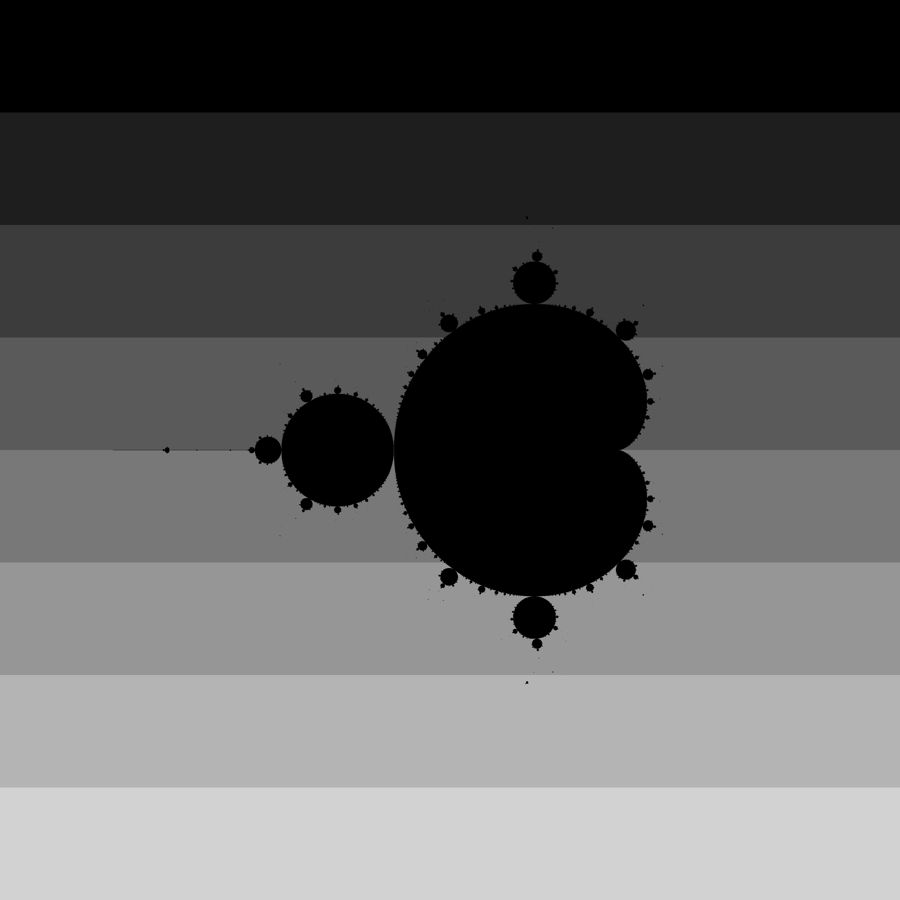

# Mandelbrot_Set

This program generates and saves an image of the Mandelbrot Set fractal using multi-threading to speed up the calculation. The Mandelbrot Set is a famous fractal that can be generated using an iterative formula. This implementation utilizes multiple threads to divide the work of calculating and coloring each pixel of the fractal, which significantly improves performance, especially for larger images.

# Key Components of the Code :
<ul>
<li><b>Constants</b></li>
iXmax, iYmax: Resolution of the image (3200x3200 pixels).
CxMin, CxMax, CyMin, CyMax: Boundaries for the real and imaginary parts of the complex numbers used to compute the Mandelbrot Set.
MaxColorComponentValue: Maximum value for the color components (set to 255, which corresponds to 8-bit colors).
IterationMax: Maximum number of iterations for the escape condition (3000 iterations).
EscapeRadius: The radius used to determine when a point has "escaped" the Mandelbrot Set (value of 2).
<li><b>Coloring</b></li>
The color of each pixel is determined by the thread that is processing that part of the image. The color is assigned based on the thread ID to visually differentiate the work done by each thread.
<li><b>Parallelization</b></li>
The task of generating the Mandelbrot Set is split into multiple threads. Each thread calculates a subset of rows of the image.
The program asks the user to input the number of threads (num_threads). The image is divided into num_threads chunks, and each thread handles a portion of the rows.
Each thread calculates the corresponding section of the fractal, assigns colors to pixels based on the number of iterations to escape, and stores the results in the global color array.
<li><b>Mandelbrot Calculation</b></li>
For each pixel (iX, iY) in the image, the corresponding complex number (Cx, Cy) is computed based on the pixel's position in the complex plane.
The iterative formula for the Mandelbrot Set is applied to each complex number:
𝑍 = 𝑍^2 + 𝐶
where Z starts at 0, and is the complex number corresponding to the pixel. If the magnitude of 𝑍 exceeds 2 during the iterations, the pixel is considered to have "escaped," and the number of iterations is recorded.
The number of iterations before escaping determines the color of the pixel.
<li><b>Image Output</b></li>
The resulting pixel colors are stored in the color array, and the image is saved in the PPM (Portable Pixmap) format. The PPM format is a simple text-based image format that allows storing raw RGB pixel data.
<li><b>Timing</b></li>
The program measures the execution time for the parallel computation and prints the time taken in milliseconds.
</ul>

#### To compile this program in the Linux terminal, use the following command:
`g++ -std=c++11 -pthread -o App App.cpp`

`./App` 
<ul>
   <li>-std=c++11 : Specifies the use of the C++11 standard.</li>
   <li>-pthread : Enables multi-threading, allowing the program to run more efficiently when working with large matrices.</li>
</ul>

# Result

